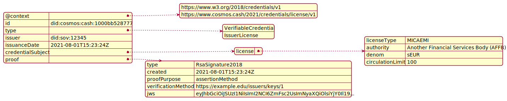

# ADR 005: A VASP license based on W3C verifiable credentials

## Table of Contents

* [Changelog](#changelog)
* [Status](#status)
* [Abstract](#abstract)
* [Context](#context)
	* [Terminology](#terminology)
* [Decision](#decision)
	* [Credential Defintion](#credential-defintion)
	* [Overall Structure](#overall-structure)
	* [VASP](#vasp)
	* [Legal Person](#legal-person)
		* [Name](#name)
		* [Name Type](#name-type)
	* [Identification Type](#identification-type)
		* [Identifier Type Code](#identifier-type-code)
	* [Address](#address)
		* [Address Type](#address-type)
	* [License](#license)
	* [Agreement](#agreement)
	* [Example Credential](#example-credential)
* [Consequences](#consequences)
	* [Backwards Compatibility](#backwards-compatibility)
	* [Positive](#positive)
	* [Negative](#negative)
	* [Neutral](#neutral)
* [Further Discussions](#further-discussions)
* [References](#references)


## Changelog

* 29-Jul-2021: Initial Draft
* 09-Aug-2021: Second Draft

## Status

DRAFT - Not Implemented

---

## Abstract

Financial services regulation is based on licenses issued by a publicly appointed authority for a given jurisdiction. Licenses allow legal entities to perform activities such holding client money, offer financial advice etc. Typically a record of all issued licensees is maintained centrally in a public registry such as the [FCA register](https://register.fca.org.uk/s/). 

This ADR describes the structure of a Financial Services License based on the [W3C specification](https://www.w3.org/TR/vc-data-model/) for verifiable credential. This credential will be signed by the relevant authority and can be used as proof of identity (for example, when establishing relationships with new clients) and proof that holder can perform claimed services.

With respect to Cosmos Cash, any legal person with a suitable license can present this evidence of authority and perform network services, such as: 

* Mint or burn e-money tokens
* Operate a Decentralized Exchange 

---

## Context

[ADR-003 defines an issuer module](https://github.com/allinbits/cosmos-cash/blob/main/docs/Explanation/ADR/adr-003-issuer.md). One of the actors defined in that ADR was an issuer. This issuer would hold a license that gives permissions to perform certain activities. The license is issued by an authority actor: the regulator.

The use cases of Role-based permissions on-chain extends to other services or protocols. For example, exchange and custody services. A definition that can extend to these cases would be vital.

Current regulation is typically based around a single jurisdiction.  Each jurisdiction can have one or more authorities. Each authority manages one or more financial services and licenses legal persons for these services. In effect a single legal person can have one or more licenses to provide different services from different authorities. 

In the case of the EU, regulation can extend across multiple jurisdiction, specifically passporting means that licensed legal persons in one jurisdiction can offer the same financial services in another EU-based jurisdiction. 

[OpenVASP](https://openvasp.org) defines a [credential](https://github.com/OpenVASP/ovips/blob/master/ovip-0015.md) and [ovip-0013](https://github.com/OpenVASP/ovips/blob/master/ovip-0013.md) as part of their protocol. 

### Terminology

* `Legal Person`: any person or entity that is able to perform legal activties, such as enter into contracts, own property, and so on
* `Virtual Asset Service Provider`: FATF defines a VASP as the following: *“Any natural/legal person who ...  as a business conducts one or more of the following activities or operations for or on behalf of another natural or legal person: i. exchange between virtual assets and fiat currencies; ii. exchange between one or more forms of virtual assets; iii. transfer of virtual assets; iv. safekeeping and/or administration of virtual assets or instruments enabling control over virtual assets; and v. participation in and provision of financial services related to an issuer’s offer and/or sale of a virtual asset.”*
* `Regulator`: entities established by governments or other organizations to oversee the functioning and fairness of financial markets and the firms that engage in financial activity.
* `DID`: Decentralised Identifier. W3C defines a DID as *"A portable URL-based identifier ... associated with an entity ... An example of a DID is did:example:123456abcdef"*

> **DISCUSSION NOTES:** 
> * Need to decide between 'legal person' and `legal entity`. `legal person` has a legal meaning, but `legal entity` is closer to W3C documentation where it refers to "entities"

---

## Decision

Within Cosmos Cash, licenses will be based upon Verifiable Credentials, as per [W3C Recommendation](https://www.w3.org/TR/vc-data-model/).  These SHALL BE called a `LicenseCredential`.

* Each credential SHALL BE issued by a single authority. 
* The credential SHALL BE issued to a single legal person.
* The legal person will be denoted by their **PUBLIC DID**. 
* DID SHALL BE the primary means for identification of VASPs and authorities.
* Each credential SHALL DEFINE the services that legal person can perform on-chain.
* The credential Schema SHALL BE stored in a Verifiable Data Registry (VDR)
* The credential SHALL BE stored in the same VDR AND be viewed. 
* Licenses CAN NOT expire, but CAN BE revoked.
* Licenses SHALL BE revoked through the removal of one or more licenses by the authority.

### Credential Structure

Overall structure is based on standard verifiable credentials.



| Level 1             | Level 2        | Type          					| Mult. | Notes                                         |
| :------------------ | :------------- | :----------------------------- | :---- | :-------------------------------------------- |
| `@context`          |                |               					| 1..1  | See [W3C Contexts Data Model](https://www.w3.org/TR/vc-data-model/#contexts)      |
| `id`                |                | DID          					| 1..1  | See [W3C Identifiers Data Model](https://www.w3.org/TR/vc-data-model/#identifiers)                   |
| `type`              |                | List[String]  					| 1..1  | See [W3C Types Data Model](https://www.w3.org/TR/vc-data-model/#types)|
| `issuer`            |                | DID           					| 1..1  |                     |
| `issuanceDate`      |                | String        					| 1..1  | Date format SHALL BE [RFC3339](https://datatracker.ietf.org/doc/html/rfc3339) standard |
| `credentialSubject` |                |             					| 1..1  |                                               |
|                     | `vasp`         | [VASP](#vasp)					| 1..1  |                                               |
|                     | `license`      | List[[License](#license)]		| 0..*  |                                    			|
|                     | `agreement`    | List[[Agreement](#agreement)]	| 0..*  |                                               |
| `proof`			  |				   | 								| 1..*  | As per [W3C Proofs Data Model](https://www.w3.org/TR/vc-data-model/#proofs-signatures) |


**Notes:**

* Contexts CAN TAKE this value as an example: 
`[
    "https://www.w3.org/2018/credentials/v1",
    "https://www.cosmos.cash/2021/credentials/license/v1"
  ]`. 
* License Credential SHALL BE versioned based on the context
* `id` SHALL BE the DID of credential subject  
* Types SHALL TAKE this value `["VerifiableCredential", "LicenseCredential"]`
* `issuer` SHALL BE the DID of credential issuer 

> **DISCUSSION NOTES:** 
> * What does `agreement` mean? It is not obvious from OpenVASP specification -> candidate for removal.
> * Is identity `credentialSubject/type` actually required? again, it is not obvious what this means? Propse that this is removed from LicenseCredential
> Does it make sense to have id in credential "header" AND the "credentialSubject"?
> Removed version from the `credentialSubject` because saying we can use context to do this instead.


### VASP

A **Virtual Asset Service Provider (VASP)** SHALL BE the legal person that can perform licensed activities. They will have a DID, one or more names, a registered address and one or more identifiers for tax, license and operating purposes.

| Level 1            | Name      		| Type                                          | Mult. | Notes                    |
| :----------------- | :-------- 		| :-------------------------------------------- | :---- | :----------------------- |
| VASP Identifier    | `vaspId`  		| DID                                           | 1..1  |                          |
| Legal person       | `legalPerson`	| [Legal Person](#legal-person)                 | 0..1  |                          |
| Address            | `address` 		| [Address](#address)                           | 1..1  |                          |
| Identifiers		 | `ids`      		| [Identification Type](#identification-type)   | 1..*  |                          |

**Notes:** 

* The Decentralised Identifier (DID) for subject SHALL BE a **PUBLIC DID**.
* Unlike OpenVASP there is no concept of Natural Person in this credential. This WILL BE separated into a KYC credential
* OpenVASP `vaspId` is a string and must be a VASP Identifier as specified in [ovip-0002](https://github.com/OpenVASP/ovips/blob/master/ovip-0002.md). This is a string that is very similar to [IBANs](https://www.iban.com/). In our specification Decentralized Identifiers SHALL BE used.


### Legal Person

A legal person CAN HAVE multiple names representing a legal name, trading and short name. A relevant example would be where *All in Bits GmBH* is a LEGAL name, but *Tendermint* is a TRADING name. 

Within this specification, a Legal Person MUST HAVE at least one name AND this must be a LEGAL name (see [Name Type](#name-type))

This defintion follows OpenVASP proposal of local and phonetic names. These SHALL BE optional.

| Level 2         		| Name            | Type                  | Mult.  | Notes                    |
| :-------------------- | :-------------- | :-------------------- | :----- | :----------------------- |
| Name            		| `name`          | List[[Name](#name)]	  | 1..*   |                          |
| Local Name      		| `nameLocal`     | List[[Name](#name)]	  | 0..*   |                          |
| Phonetic Name   		| `namePhonetic`  | List[[Name](#name)]	  | 0..*   |                          |
| Registration Country 	| `regCtry`		  | String(2)			  | 1..1   | `regCtry` MUST BE formatted as per [ISO 3166-1](https://www.iso.org/obp/ui/#iso:std:iso:3166:-1:ed-4:v1:en) |


#### Name 

Each `Name` SHALL HAVE two values: the name itself and a value denoting the type.

| Level 3   | Name        | Type                    | Mult. | Notes     |
| :-------- | :---------- | :---------------------- | :---- | :-------- |
| Name      | `name`      | String                  | 1..1  |           |
| Name type | `nameType`  | [Name Type](#name-type) | 1..1  |           |

#### Name Type

`Name type` identifies the nature of the name being specified for a legal person. `Name Type` CAN TAKE the following values:

| Code   | Name         | Description                                             |
| :----- | :----------- | :------------------------------------------------------ |
| `LEGL` | Legal name   | Official name under which an organization is registered |
| `SHRT` | Short name   | Short name of the organization                          |
| `TRAD` | Trading name | Name used by the organization for commercial purposes   |

### Identification Type

| Level 2                  | Name      		| Type                                             | Mult. | Notes     	|
| :----------------------- | :------------- | :----------------------------------------------- | :---- | :---------	|
| Identifier      		   | `idId`   		| String                                           | 1..1  |           	|
| Identifier Type		   | `idType` 		| [Identifier Type Code](#identifier-type-code)    | 1..1  |			|
| Country of issue         | `idCtry`		| String                                           | 0..1  |			|
| Registration Authority   | `idAuthority`  | String                                           | 0..1  |			|

**Notes:**

* If value of `idType` is in [`RAID`, `TXID`, `MISC`] then `idAuthority` MUST BE present.
* If the value of `idType` is `LEIX` then `id_reg` MUST NOT BE present.
* `idCtry` MUST BE formatted as per [ISO 3166-1](https://www.iso.org/obp/ui/#iso:std:iso:3166:-1:ed-4:v1:en).
* `idAuthority` MUST BE a valid [GLEIF Registration Authority Code](https://www.gleif.org/en/about-lei/code-lists/gleif-registration-authorities-list)

#### Identifier Type Code

Identifies the national identification type.

| Code   | Name                               | Description                                                  			|
| :----- | :--------------------------------- | :---------------------------------------------------------------------- |
| `ARNU` | Alien registration number          | Number assigned by a government agency to identify foreign nationals 	|
| `CCPT` | Passport number                    | Number assigned by a passport authority                      			|
| `RAID` | Registration authority identifier  | Identifier of a legal entity as maintained by a registration entity 	|
| `DRLC` | Driver license number              | Number assigned to a driver's license                        			|
| `FIIN` | Foreign investment identity number | Number assigned to a foreign investor (other than the alien number) 	|
| `TXID` | Tax identification number          | Number assigned by a tax authority to an entity              			|
| `SOCS` | Social security number             | Number assigned by a social security agency                  			|
| `IDCD` | Identity card number               | Number assigned by a national authority to an identity card  			|
| `LEIX` | Legal Entity Identifier            | Legal Entity Identifier (LEI) as per [ISO 17442](https://www.gleif.org/en/about-lei/iso-17442-the-lei-code-structure) |
| `MISC` | Unspecified                        | A national identifier which is known but cannot be categorized by the sender |

**Notes:**

* This is more generic than required for a VASP, but this COULD BE reused for KYC credentials.


### Address

Unlike OpenVASP, `address` SHALL USE collonly defined standards for address, that include:

* `ctry` SHALL FOLLOW [ISO 3166-1](https://www.iso.org/obp/ui/#iso:std:iso:3166:-1:ed-4:v1:en).
* `adminArea` SHALL FOLLOW [ISO 3166-2](https://www.iso.org/obp/ui/#iso:std:iso:3166:-2:ed-4:v1:en) 
* Address fields SHALL FOLLOW [xNAL standards](https://www.drupal.org/project/addressfield)

Address currently WILL NOT permit geographical coordinates.

| Level 2             		| Name          | Type                          | Mult. | Notes         						|
| :------------------------ | :------------ | :---------------------------- | :---- | :------------------------------------ |
| Address type        		| `adrType`     | [Address Type](#address-type) | 1..1  |               						|
| Sub-Premise         		| `subPremise`  | String						| 0..1  | Equivalent of Floor, sub-unit etc.	|
| Premise		      		| `premise`     | String						| 0..1  | Equivalent of , Box Number etc.		|
| thoroughfare        		| `thfare`      | String						| 0..1  | Equivalent Street Address or Road		|
| Post code           		| `postcode`    | String						| 0..1  | Equivalent of zip code				|
| Locality            		| `town`        | String						| 1..1  | Equivalent of Town or City			|
| Sub Administrative Area 	| `subAdminArea`| String						| 0..1  |               						|
| administrative_area 		| `adminArea`   | String						| 0..1  | Equivalent of State/Province/Region	|
| Country             		| `ctry`        | String						| 1..1  |               						|


#### Address Type

Identifies the nature of the address

| Code   | Name        | Description                  | Notes     |
| :----- | :---------- | :--------------------------- | :-------- |
| `HOME` | Residential | Home address                 |           |
| `BIZZ` | Business    | Business address             |           |
| `GEOG` | Geographic  | Unspecified physical address |           |


### License


| Level 2       | Name        	   | Type          | Mult. | Notes     													   |
| :------------ | :--------------- | :------------ | :---- | :------------------------------------------------------------ |
| License Type	| `licenseType`    | String        | 1..1  | Name of recognized license or registration    				   |
| Country		| `country`   	   | String(2)     | 1..1  | Uses [ISO 3166-1](https://www.iso.org/obp/ui/#iso:std:iso:3166:-1:ed-4:v1:en) |
| Authority		| `authority` 	   | String        | 1..1  | Licensing authority                           				   |
| License ID	| `licenseId`      | String        | 0..1  | License number                                				   |


### Agreement

| Level 2       	| Name        	  | Type          | Mult. | Notes     									  |
| :---------------- | :-------------- | :------------ | :---- | :-------------------------------------------- |
| Agreement Type	| `agreementType` | String        | 1..1  | `NetworkAgreement_v1.0`                       |
| Message Families  | `msgFamilies`   | List[String]  | 1..1  | Covered message families (e.g. `TFR`, `ALL`)  |


### Example Credential

Example credential in `json-ld` format is as follows:

```javascript
{
	"@context": [
		"https://www.w3.org/2018/credentials/v1",
		"https://www.cosmos.cash/2021/credentials/license/v1"
	],
	"id": "did:cosmos:cash:1000bb528777",
	"type": [
		"VerifiableCredential", 
		"LicenseCredential"
	],
	"issuer": "did:sov:12345",
	"issuanceDate": "2021-08-01T15:23:24Z",
	"credentialSubject": {
		"vasp": {
			"vaspId": "did:cosmos:cash:1000bb528777",
			"legalPerson": {
				"names": [{
					"name": "Example VASP AG",
					"nametype": "LEGL"
				}, {
					"name": "EgVASP",
					"nametype": "SHRT"
				}],
				"ctryReg": "CH"
			},
			"address": {
				"adr_type": "BIZZ",
				"thfare": "Liverpool Street",
				"premise": "22",
				"postcode": "EC2R",
				"locality": "London",
				"country": "GB"
			},
			"ids": [{
				"idId": "CH02035398520",
				"idType": "RAID"
			}, {
				"idId": "529900W6B9NEA233DS71",
				"idType": "LEIX"
			}]
		},
		"licenses": [{
			"licenseType": "VQFSRO",
			"country": "CH",
			"authority": "Financial Services Standards Association (VQF)" // should authority be a DID?
		}, {
			"licenseType": "MICAEMI", // here is a MiCA EMI license, for example
			"country": "CH",
			"authority": "Another Financial Services Body (AFFB)",
			"attributes": {
				"denom": "sEUR",
				"circulationLimit": 100.0,  
			}
		}],
		"agreement": {
			"type": "NetworkAgreement_v1.0",
			"mf": "ALL"
		}
	},
	"proof": {
		"type": "RsaSignature2018",
		"created": "2021-08-01T15:23:24Z",
		"proofPurpose": "assertionMethod",
		"verificationMethod": "https://example.edu/issuers/keys/1",
		"jws": "eyJhbGciOiJSUzI1NiIsImI2NCI6ZmFsc2UsImNyaXQiOlsiYjY0Il19..." // truncated for readability
  	}
}
```

## Consequences

> This section describes the resulting context after applying the decision. List all consequences here, taking care not to list only the "positive" consequences. A particular decision may have positive, negative, and neutral consequences, but all of the consesquences affect the team and project in the future.

### Backwards Compatibility

> All ADRs that introduce backwards incompatibilities must include a section describing these incompatibilities and their severity. The ADR must explain how the author proposes to deal with these incompatibilities. ADR submissions without a sufficient backwards compatibility treatise may be rejected outright.

### Positive

{positive consequences}

### Negative

{negative consequences}

### Neutral

{neutral consequences}

## Further Discussions

While an ADR is in the DRAFT or PROPOSED stage, this section contains a summary of issues to be solved in future iterations. The issues summarized here can reference comments from a pull request discussion.
Later, this section can optionally list ideas or improvements the author or reviewers found during the analysis of this ADR.

## References

- {reference link}
