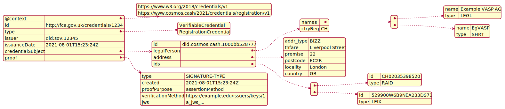

# ADR 005: A VASP Registration Credential based on W3C Standards

## Table of Contents

- [ADR 005: A VASP Registration Credential based on W3C Standards](#adr-005-a-vasp-registration-credential-based-on-w3c-standards)
	- [Table of Contents](#table-of-contents)
	- [Changelog](#changelog)
	- [Status](#status)
	- [Abstract](#abstract)
	- [Context](#context)
		- [Terminology](#terminology)
	- [Decision](#decision)
		- [Credential Structure](#credential-structure)
		- [Legal Person](#legal-person)
			- [Name](#name)
			- [Name Type](#name-type)
		- [Identification Type](#identification-type)
			- [Identifier Type Code](#identifier-type-code)
		- [Address](#address)
			- [Address Type](#address-type)
		- [Example Credential](#example-credential)
	- [Consequences](#consequences)
		- [Backward Compatibility](#backward-compatibility)
		- [Positive](#positive)
		- [Negative](#negative)
		- [Neutral](#neutral)
	- [Further Discussions](#further-discussions)
	- [References](#references)
## Changelog

* 29-Jul-2021: Initial Draft
* 09-Aug-2021: Second Draft

## Status

DRAFT - Not Implemented

---

## Abstract

Financial services regulation is based on registrations issued by publicly appointed authorities for a given jurisdiction. Registrations together with licenses allow legal entities to perform activities such holding client money, offer financial advice etc. Typically a regulator will maintain a central public registry, for example the [FCA register](https://register.fca.org.uk/s/). 

This ADR describes the structure of a Financial Services registration based on the [W3C specification](https://www.w3.org/TR/vc-data-model/) for verifiable credential. This credential will be signed by the relevant authority and can be used as proof of identity such as when establishing relationships with new clients or counterparties.

---

## Context

[ADR-003](https://github.com/allinbits/cosmos-cash/blob/main/docs/Explanation/ADR/adr-003-issuer.md) identified an `issuer` actor. This issuer holds a license that gives permissions to perform certain activities. The license is issued by an authority actor: the regulator.

The use cases of Role-based permissions on-chain extends to other services or protocols. For example, exchange and custody services. A definition that can extend to these cases would be vital.

Current regulation is typically based around a single jurisdiction.  Each jurisdiction can have one or more authorities. Each authority manages one or more financial services and licenses legal persons for these services. In effect a single legal person can have one or more licenses to provide different services from different authorities. 

In the case of the EU, regulation can extend across multiple jurisdiction, specifically passporting means that licensed legal persons in one jurisdiction can offer the same financial services in another EU-based jurisdiction. 

[OpenVASP](https://openvasp.org) defines a [credential](https://github.com/OpenVASP/ovips/blob/master/ovip-0015.md) and [ovip-0013](https://github.com/OpenVASP/ovips/blob/master/ovip-0013.md) as part of their protocol. 

### Terminology

See [Glossary](../../reference/Glossary.md) for specific terms.

> **NOTES:** 
> In this ADR we SHALL USE `legal person` rather than `legal entity`. The terms are interchangeable, but `legal person` has a legal meaning. Note that W3C documentation uses `legal entity` when it refers to `legal person`

---

## Decision

Within Cosmos Cash, registrations will be based upon Verifiable Credentials, as per [W3C Recommendation](https://www.w3.org/TR/vc-data-model/).  These SHALL BE called a `RegistrationCredential`.

- Each credential SHALL BE issued by a single authority. 
- The credential SHALL BE issued to a single legal person.
- The legal person will be denoted by their **PUBLIC DID**. 
- DID SHALL BE the primary means for identification of VASPs and authorities.
- The credential Schema SHALL BE stored in a Verifiable Data Registry (VDR)
- The credential SHALL BE stored in the same VDR AND be viewed. 
- Registrations CAN NOT expire, but CAN BE revoked under certain circumstances such as 
  - The holder no longer exists
  - Some form of malpractice.


### Credential Structure

Overall structure is based on standard verifiable credentials.



| Level 1             | Level 2        | Type          								   | Mult. | Notes                                         |
| :------------------ | :------------- | :-------------------------------------------- | :---- | :-------------------------------------------- |
| `@context`          |                |               								   | 1..1  | See [W3C Contexts Data Model](https://www.w3.org/TR/vc-data-model/#contexts)      |
| `id`                |                | 	          								   | 1..1  | See [W3C Identifiers Data Model](https://www.w3.org/TR/vc-data-model/#identifiers)                   |
| `type`              |                | List[String]  								   | 1..1  | See [W3C Types Data Model](https://www.w3.org/TR/vc-data-model/#types)|
| `issuer`            |                | DID           								   | 1..1  | DID of credential issuer, for example "did:sov:12345" |
| `issuanceDate`      |                | String        								   | 1..1  | Date format SHALL BE [RFC3339](https://datatracker.ietf.org/doc/html/rfc3339) standard |
| `credentialSubject` |                |             								   | 1..1  | 
|					  | `id`  	   	   | DID                                           | 1..1  | DID of credential subject, for example "did:cosmos:cash:12345"  |
|					  | `issuerId`	   | DID                                           | 1..1  | DID of credential issuer, for example "did:sov:12345"           |
|					  | `legalPerson`  | [Legal Person](#legal-person)                 | 0..1  |                          |
| 			          | `address` 	   | [Address](#address)                           | 1..1  |                          |
| 			          | `ids`      	   | [Identification Type](#identification-type)   | 1..*  |                          |
| `proof`			  |				   | 											   | 1..*  | As per [W3C Proofs Data Model](https://www.w3.org/TR/vc-data-model/#proofs-signatures) |


**Notes:**

* Contexts CAN TAKE this value as an example: 
`[
    "https://www.w3.org/2018/credentials/v1",
    "https://www.cosmos.cash/2021/credentials/registration/v1"
  ]`. 
* Registration Credential SHALL BE versioned based on the context
* `id` SHALL BE the ID of credential, for example "http://fca.gov.uk/credentials/1234"
* Types SHALL TAKE this value `["VerifiableCredential", "RegistrationCredential"]`
* Unlike the OpenVASP standard, the version is no longer part of the `credentialSubject`. The  context SHALL BE USED to do this instead.
* The subject of the credential SHALL BE the registered legal person. They will have a DID, one or more names, a registered address and one or more identifiers for tax, license and operating purposes.
* OpenVASP `vaspId` is a string and must be a VASP Identifier as specified in [ovip-0002](https://github.com/OpenVASP/ovips/blob/master/ovip-0002.md). This is a string that is very similar to [IBANs](https://www.iban.com/). In our specification Decentralized Identifiers SHALL BE used. This SHALL BE a **PUBLIC DID**, for example "did:git:df1245"


### Legal Person

A legal person CAN HAVE multiple names representing a legal name, trading and short name. A relevant example would be where *All in Bits GmBH* is a LEGAL name, but *Tendermint* is a TRADING name. 

Within this specification, a Legal Person MUST HAVE at least one name AND this must be a LEGAL name (see [Name Type](#name-type))

This defintion follows OpenVASP proposal of local and phonetic names. These SHALL BE optional.

| Level 2         		| Name            | Type                  | Mult.  | Notes                    |
| :-------------------- | :-------------- | :-------------------- | :----- | :----------------------- |
| Name            		| `name`          | List[[Name](#name)]	  | 1..*   |                          |
| Local Name      		| `nameLocal`     | List[[Name](#name)]	  | 0..*   |                          |
| Phonetic Name   		| `namePhonetic`  | List[[Name](#name)]	  | 0..*   |                          |
| Registration Country 	| `regCtry`		  | String(2)			  | 1..1   | `regCtry` MUST BE formatted as per [ISO 3166-1](https://www.iso.org/obp/ui/#iso:std:iso:3166:-1:ed-4:v1:en) |


#### Name 

Each `Name` SHALL HAVE two values: the name itself and a value denoting the type.

| Level 3   | Name        | Type                    | Mult. | Notes     |
| :-------- | :---------- | :---------------------- | :---- | :-------- |
| Name      | `name`      | String                  | 1..1  |           |
| Name type | `type`  	  | [Name Type](#name-type) | 1..1  |           |


#### Name Type

A legal person can operate using a range of different names - see the example above. `Name Type` CAN TAKE the following values:

| Code   | Name         | Description                                             |
| :----- | :----------- | :------------------------------------------------------ |
| `LEGL` | Legal name   | Official name under which an organization is registered |
| `SHRT` | Short name   | Short name of the organization                          |
| `TRAD` | Trading name | Name used by the organization for commercial purposes   |

### Identification Type

| Level 2                  | Name      		| Type                                             | Mult. | Notes     	|
| :----------------------- | :------------- | :----------------------------------------------- | :---- | :---------	|
| Identifier      		   | `id`   		| String                                           | 1..1  |           	|
| Identifier Type		   | `type` 		| [Identifier Type Code](#identifier-type-code)    | 1..1  |			|
| Country of issue         | `idCtry`		| String                                           | 0..1  |			|
| Registration Authority   | `idAuthority`  | String                                           | 0..1  |			|

**Notes:**

* If value of `type` is in [`RAID`, `TXID`, `MISC`] then `idAuthority` MUST BE present.
* If the value of `type` is `LEIX` then `idAuthority` MUST NOT BE present.
* `idCtry` MUST BE formatted as per [ISO 3166-1](https://www.iso.org/obp/ui/#iso:std:iso:3166:-1:ed-4:v1:en).
* `idAuthority` MUST BE a valid [GLEIF Registration Authority Code](https://www.gleif.org/en/about-lei/code-lists/gleif-registration-authorities-list)

#### Identifier Type Code

Identifies the national identification type.

| Code   | Name                               | Description                                                  			|
| :----- | :--------------------------------- | :---------------------------------------------------------------------- |
| `ARNU` | Alien registration number          | Number assigned by a government agency to identify foreign nationals 	|
| `CCPT` | Passport number                    | Number assigned by a passport authority                      			|
| `RAID` | Registration authority identifier  | Identifier of a legal entity as maintained by a registration entity 	|
| `DRLC` | Driver license number              | Number assigned to a driver's license                        			|
| `FIIN` | Foreign investment identity number | Number assigned to a foreign investor (other than the alien number) 	|
| `TXID` | Tax identification number          | Number assigned by a tax authority to an entity              			|
| `SOCS` | Social security number             | Number assigned by a social security agency                  			|
| `IDCD` | Identity card number               | Number assigned by a national authority to an identity card  			|
| `LEIX` | Legal Entity Identifier            | Legal Entity Identifier (LEI) as per [ISO 17442](https://www.gleif.org/en/about-lei/iso-17442-the-lei-code-structure) |
| `MISC` | Unspecified                        | A national identifier which is known but cannot be categorized by the sender |

**Notes:**

* This is more generic than required for a VASP, but this COULD BE reused for KYC credentials.

### Address

Unlike OpenVASP, `address` SHALL USE collonly defined standards for address, that include:

* `ctry` SHALL FOLLOW [ISO 3166-1](https://www.iso.org/obp/ui/#iso:std:iso:3166:-1:ed-4:v1:en).
* `adminArea` SHALL FOLLOW [ISO 3166-2](https://www.iso.org/obp/ui/#iso:std:iso:3166:-2:ed-4:v1:en) 
* Address fields SHALL FOLLOW [xNAL standards](https://www.drupal.org/project/addressfield)

Address currently WILL NOT permit geographical coordinates.

| Level 2             		| Name          | Type                          | Mult. | Notes         						|
| :------------------------ | :------------ | :---------------------------- | :---- | :------------------------------------ |
| Address type        		| `adrType`     | [Address Type](#address-type) | 1..1  |               						|
| Sub-Premise         		| `subPremise`  | String						| 0..1  | Equivalent of Floor, sub-unit etc.	|
| Premise		      		| `premise`     | String						| 0..1  | Equivalent of , Box Number etc.		|
| thoroughfare        		| `thfare`      | String						| 0..1  | Equivalent Street Address or Road		|
| Post code           		| `postcode`    | String						| 0..1  | Equivalent of zip code				|
| Locality            		| `town`        | String						| 1..1  | Equivalent of Town or City			|
| Sub Administrative Area 	| `subAdminArea`| String						| 0..1  |               						|
| administrative_area 		| `adminArea`   | String						| 0..1  | Equivalent of State/Province/Region	|
| Country             		| `ctry`        | String						| 1..1  |               						|

#### Address Type

Identifies the nature of the address

| Code   | Name        | Description                  | Notes     |
| :----- | :---------- | :--------------------------- | :-------- |
| `HOME` | Residential | Home address                 |           |
| `BIZZ` | Business    | Business address             |           |
| `GEOG` | Geographic  | Unspecified physical address |           |


### Example Credential

Example Registration Credential in `json-ld` format is as follows:

```javascript
{
	"@context": [
		"https://www.w3.org/2018/credentials/v1",
		"https://www.cosmos.cash/2021/credentials/registration/v1"
	],
	"id": "http://fca.gov.uk/credentials/1234",
	"type": [
		"VerifiableCredential", 
		"RegistrationCredential"
	],
	"issuer": "did:sov:12345",
	"issuanceDate": "2021-08-01T15:23:24Z",
	"credentialSubject": {
		"id": "did:cosmos:cash:1000bb528777",
		"issuerId": "did:sov:12345"
		"legalPerson": {
			"names": [{
				"name": "Example VASP AG",
				"type": "LEGL"
			}, {
				"name": "EgVASP",
				"type": "SHRT"
			}],
			"ctryReg": "CH"
		},
		"address": {
			"addr_type": "BIZZ",
			"thfare": "Liverpool Street",
			"premise": "22",
			"postcode": "EC2R",
			"locality": "London",
			"country": "GB"
		},
		"ids": [{
			"id": "CH02035398520",
			"type": "RAID"
		}, {
			"id": "529900W6B9NEA233DS71",
			"type": "LEIX"
		}]
	},
	"proof": {
		"type": "RsaSignature2018",
		"created": "2021-08-01T15:23:24Z",
		"proofPurpose": "assertionMethod",
		"verificationMethod": "https://example.edu/issuers/keys/1",
		"jws": "eyJhbGciOiJSUzI1NiIsImI2NCI6ZmFsc2UsImNyaXQiOlsiYjY0Il19..." // truncated for readability
  	}
}
```

## Consequences

> This section describes the resulting context after applying the decision. List all consequences here, taking care not to list only the "positive" consequences. A particular decision may have positive, negative, and neutral consequences, but all of the consesquences affect the team and project in the future.

### Backward Compatibility

This is the first definition of the credential. Backwards compatibility is not a concern. 

### Positive

This ADR offers the following benefits

- A public VASP registry maintained by a regulator
- A verified registration credential issued by a regulator provides guarantees to new clients that the holder is a registered VASP. Combined with a license credential it offer guarantees to the 
- The credential is compatible with W3C standards

### Negative

{negative consequences}

### Neutral

{neutral consequences}

## Further Discussions

While an ADR is in the DRAFT or PROPOSED stage, this section contains a summary of issues to be solved in future iterations. The issues summarized here can reference comments from a pull request discussion.
Later, this section can optionally list ideas or improvements the author or reviewers found during the analysis of this ADR.

## References

- {reference link}
