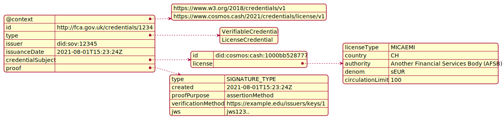

# ADR 005: An Issuer License based on W3C Verifiable Credential Standards

## Table of Contents

- [ADR 005: An Issuer License based on W3C Verifiable Credential Standards](#adr-005-an-issuer-license-based-on-w3c-verifiable-credential-standards)
  - [Table of Contents](#table-of-contents)
  - [Changelog](#changelog)
  - [Status](#status)
  - [Abstract](#abstract)
  - [Context](#context)
    - [Terminology](#terminology)
  - [Decision](#decision)
    - [Credential Structure](#credential-structure)
    - [License](#license)
      - [License Type](#license-type)
    - [Example Credential](#example-credential)
  - [Consequences](#consequences)
    - [Backward Compatibility](#backward-compatibility)
    - [Positive](#positive)
    - [Negative](#negative)
    - [Neutral](#neutral)
  - [Further Discussions](#further-discussions)
  - [References](#references)


## Changelog

* 18-Aug-2021: Initial Draft

## Status

DRAFT - Not Implemented

---

## Abstract

Financial services regulation is based on registrations that are issued by a publicly appointed authority for a given jurisdiction. Registrations, together with licenses, allow legal entities to perform activities such as holding client money, offering financial advice, and so on. Typically a regulator maintains a central public registry like the [FCA register](https://register.fca.org.uk/s/). 

This ADR describes the structure of an issuer license based on the W3C [Verifiable Credentials Data Model 1.0](https://www.w3.org/TR/vc-data-model/) specification. This license makes reference to the classes of crypto assets described in MiCA, but the license could easily be adopted as proof of authority to issue various types of crypto or virtual assets. In all cases, this credential will be signed by an `authority` and acts as proof that the holder can offer the financial services defined in the License Credential.

## Context

Current regulation is typically based around a single jurisdiction. Each jurisdiction can have one or more authorities who regulate one or more types of financial service. These authorities typically issue license or permits to qualified legal persons. Licenses permit the holder to offer services subject to defined constraints. A legal person can have one or more licenses to provide different services from different authorities. 

In the case of the EU, regulation can extend across multiple jurisdictions through a passporting mechanism. This mechanism allows licensed legal persons in one jurisdiction to offer the same financial services in another EU-based jurisdiction. 

[OpenVASP](https://openvasp.org) defines the [ovip-15](https://github.com/OpenVASP/ovips/blob/master/ovip-0015.md) and [ovip-0013](https://github.com/OpenVASP/ovips/blob/master/ovip-0013.md) credentials as part of their protocol. These credential are an equivalent of the [registration credential](./adr-005-registration-credential.md), but this ADR 005 license credential does not define the services that a VASP can perform. 

### Terminology

See [Glossary](../../Reference/GLOSSARY.md) for specific terms.

> **DISCUSSION NOTES:** 
> - Need to decide between 'legal person' and `legal entity`. `legal person` has a legal meaning, but `legal entity` is closer to W3C documentation where it refers to "entities"

---

## Decision

Within Cosmos Cash, licenses will be based upon Verifiable Credentials, as per W3C [Verifiable Credentials Data Model 1.0](https://www.w3.org/TR/vc-data-model/) specification.  The Cosmos Cash license credential SHALL BE called an `IssuerLicense`.

- Each credential SHALL BE issued by a single authority. 
- The credential SHALL BE issued to a single legal person.
- The license entitles the holder to mint one or more tokens up to a defined limit.
- The legal person will be denoted by their **PUBLIC DID**. 
- DID SHALL BE the primary means for identification of VASPs and authorities.
- The credential schema SHALL BE stored in a Verifiable Data Registry (VDR).
- The credential SHALL BE stored in the holder's private wallet 
- Licenses CANNOT expire, but CAN BE revoked under certain circumstances such as:
  - The holder no longer exists.
  - Some form of malpractice on the part of the issuer.
- Licenses can be updated, for example in the case of an update of a change issuance limit.

### Credential Structure

Overall structure is based on standard verifiable credentials.



| Level 1             | Level 2        | Type          			| Mult. | Notes                                         |
| :------------------ | :------------- | :--------------------- | :---- | :-------------------------------------------- |
| `@context`          |                |               			| 1..1  | See [W3C Contexts Data Model](https://www.w3.org/TR/vc-data-model/#contexts)      |
| `id`                |                | DID          			| 1..1  | See [W3C Identifiers Data Model](https://www.w3.org/TR/vc-data-model/#identifiers) |
| `type`              |                | List[String]  			| 1..1  | See [W3C Types Data Model](https://www.w3.org/TR/vc-data-model/#types)|
| `issuer`            |                | DID           			| 1..1  |                     |
| `issuanceDate`      |                | String        			| 1..1  | Format SHALL BE [RFC3339](https://datatracker.ietf.org/doc/html/rfc3339) standard |
| `credentialSubject` |                |             			  | 1..1  | |
|                     | `id`           | DID          			| 1..1  | DID of the license holder |
|                     | `license`      | [License](#license)| 1..1  | |
| `proof`			        |				         | 						        | 1..*  | See [W3C Proofs Data Model](https://www.w3.org/TR/vc-data-model/#proofs-signatures) |


**Notes:**

* Contexts CAN TAKE this value as an example: 
`[
    "https://www.w3.org/2018/credentials/v1",
    "https://www.cosmos.cash/2021/credentials/issuerlicense/v1"
  ]`. 
* Issuer License Credential SHALL BE versioned based on the context
* header `id` SHALL BE the ID of credential, for example "http://fca.gov.uk/credentials/4567"
* Types SHALL TAKE this value `["VerifiableCredential", "IssuerLicense"]`
* `issuer` SHALL BE the DID of credential issuer, for example "did:sov:12345"
* `id` SHALL BE the DID of credential subject, for example "did:git:67890"
* Unlike OpenVASP's definition, this credential will not have an `agreement` structure

### License

| Level 2           | Name        	    | Type                      | Mult. | Notes     													   |
| :---------------- | :---------------- | :------------------------ | :---- | :--------------------------------------------------------------- |
| License Type	    | `licenseType`     | [License Type](#license)  | 1..1  | Name of recognized license or registration    				   |
| Country		        | `country`   	    | String(2)                 | 1..1  | Uses [ISO 3166-1](https://www.iso.org/obp/ui/#iso:std:iso:3166:-1:ed-4:v1:en) |
| Authority		      | `authority` 	    | String                    | 1..1  | Licensing authority                           				   |
| Denomination	    | `denom`           | String                    | 1..1  | Token identifier or denomination                 				   |
| Circulation Limit | `circulationLimit`| Integer                   | 1..1  | Amount of tokens that can be issued             				   |

**Notes:**

* The license type is defined by the MICA regulation and will be used to identify different types of token assets. This will be used to identify different asset classes of tokens being issued by Issuers.
* A later version of this credential COULD BE extended to include explicitly a list of all permissions that a holder can perform upon presentation of this credential. In this case this would include mint, burn, freeze, unfreeze and rescue.

#### License Type

`licenseType` CAN TAKE multiple values based on the regulation. The examples here are based on MiCA regulation:

| Code      | Name                      | Description                                  |
| :-------- | :------------------------ | :------------------------------------------- |
| `MICAEMI` | E-Money Token             | E-Money Token as defined under MiCA          |
| `MICAART` | Asset Referenced Token    | Asset Referenced Token as defined under MiCA |


### Example Credential

Example credential in `json-ld` format is as follows:

```javascript
{
	"@context": [
		"https://www.w3.org/2018/credentials/v1",
		"https://www.cosmos.cash/2021/credentials/license/v1"
	],
	"id": "http://fca.gov.uk/credentials/1234",
	"type": [
		"VerifiableCredential", 
		"LicenseCredential"
	],
	"issuer": "did:sov:12345",
	"issuanceDate": "2021-08-01T15:23:24Z",
	"credentialSubject": {
      "id": "did:cosmos:cash:1000bb528777",
      "license": {
        "licenseType": "MICAEMI", // MiCA issuer license - can fine tune this to asset backed tokens, E-Money tokens etc
        "country": "CH",
        "authority": "Another Financial Services Body (AFSB)",
        "denom": "sEUR",
        "circulationLimit": 100
      }
	},
	"proof": {
		"type": "SIGNATURE_TYPE",
		"created": "2021-08-01T15:23:24Z",
		"proofPurpose": "assertionMethod",
		"verificationMethod": "https://example.edu/issuers/keys/1",
		"jws": "jws123.." // truncated for readability
  }
}
```


## Consequences

### Backward Compatibility

This is the first definition of the credential. Backward compatibility is not a concern. 

### Positive

This ADR offers the following benefits:

- Regulatory compliance through open standards
- Implements a Role Based Access to services on Cosmos Cash.
- Uses Self-Sovereign Identity (SSI) standards so this means:
  - Interoperability - for example, the credential can be stored in a variety of different identity wallets
  - Flexibility - for example, this credential can be re-used in other scenarios where token issuance is required
- Adoption of SSI for provision of financial services offers benefits in terms of licensing and management on public platforms.

### Negative

- No negative consequences

### Neutral

There are a number of macro-level concerns, but these do not affect the adoption of this model for role-based access control (RBAC). These macro concerns include:

- Self-Sovereign Identity technologies are still relatively new. 
- eiDAS legislation is still in development.

## Further Discussions

While an ADR is in the DRAFT or PROPOSED stage, this section contains a summary of issues to be solved in future iterations. The issues summarized here can reference comments from a pull request discussion.
Later, this section can optionally list ideas or improvements the author or reviewers found during the analysis of this ADR.

## References

- {reference link}
