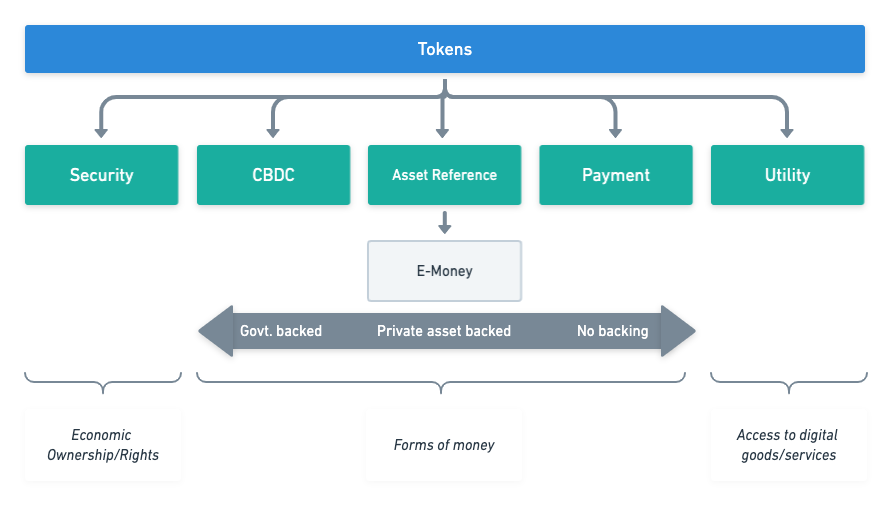

# Executive Summary

This article describes the legal requirements to create a Cosmos-SDK powered regulatory compliant e-money token. This token would have the same guarantees as the traditional banking sector thus bringing true liquidity to the crypto world. 

In this paper, the regulatory environment within Europe will be laid out. It will outline how the regulations have been drawn up and how the regulations define DLT based assets and the requirements based on these classifications. It will also briefly review the roles and permits required to perform activities relating to crypto-assets.

It is observed that:

- Financial services that are licensed under existing EU regulation have advantages under new crypto-asset legislation;
- Key deliverable from a technology perspective for issuers of e-money tokens on Decentralised Ledger Technologies - assuming issuer is authorised - is a whitepaper that details the supporting technology and associated risks;
- Anti-Money Laundering (AML) regulations are the main point of concern with regard to decentralised ledger technology and represents key regulatory risk;
- With respect to AML, some attention should be paid to the FATF "travel rule", which is not contained in current EU directive, but is part of FATF recommendations;
- The definition of validators within regulatory frameworks is unclear and forms another regulatory risk to be mitigated for an e-money token issuer;
- The EU regulatory requirements relating to the implementation of Central Bank Digital Coins (CBDC) is likely to lead to delays, but a regulated protocol with a consortium of issuers could be a way forward.

# Acknowledgements

Authors of this article would like to thank

- Amagis Capital for their backing report and many recommendations, particularly 
     - Antonio Giannino
     - Francesca Valenti
     - Andrea Vianelli
- Martin Worner at Confio.tech for his design input and reviews
- Interchain Foundation for their backing and suggestions

This paper will make significant reference to Amagis' report produced in conjunction with this report. For the sake of brevity, reference details are noted here [@Amagis:CosmosCashReport] 

## Disclaimer

This paper represents the opinions and views of the authors. It should not be any way construed as legal advice.

# Background

The value of assets secured on Distributed Ledger Technology (DLT) is increasing at ever upward rates. However, pervasiveness in the general economy is still low. This is for a number of reasons that include:

- Understanding the new technology
- Financial literacy in the general public
- Trust and public perception

Readers of this document will doubtless believe that DLT is indeed a tool of public good that can change finance for the better for millions of people. However to make that transition, appropriate regulation is important, especially as the technology matures. 

To date, jurisdictions are adopting three contrasting approaches toward crypto-assets and crypto-related services, namely:

- **Proactive approach**, adopting regulations addressed to crypto-assets and related services;
- **Neutral approach**, seeking to promote case-by-case assessments on the relevant circumstances and eventually attempting to reconduct such assets and activities to existing legislation and regulations (mostly within the payment and investment services spheres);
- **Restrictive approach**, seeking to introduce outright bans to crypto-assets and related activities.

This document will review the approach within the European Union.

# Scope

## European Union

This document will only consider European Regulation. The reasons for this are two-fold: market size and regulatory framework. 

The union (as defined as the 27 member states) represents 450 million people (third in size behind China and India) and is the second biggest trading bloc in the world. Further, the Eurozone (area using the Euro currency) 

- is the second largest economy in the world in nominal terms, after the United States;
- is the third economy largest in purchasing power parity (PPP) terms, after China and the United States;
- has a GDP estimated at 18.8 trillion USD (nominal) in 2018;
- represents approximately 22% of the global economy.

In terms of economy and demographics, the EU is globally extremely important, but with respect to DLT-based assets, as of September 2020, the EU has also taken the lead in attempting to create the first harmonised and cross-border framework applicable to crypto-assets and related activities.

In addition to legislation, the EU Commission has also been promoting a digital finance package, which includes a new strategy on digital finance for the EU financial sector. The aim is to ensure that the EU embraces the digital revolution and drives it with innovative European firms in the lead, making the benefits of digital finance available to European consumers and businesses. 

## EU Regulatory Framework

Financial legislation is guided and implemented through a network of international and national level bodies. The scope of each body defined as as per the table below [@Judge:CryptoLandscape]:

A number of supranational and intergovernmental bodies such as Bank of International Settlements (BIS), and the Financial Action Task Force (FATF), with respect to their role and responsibilities, advise on best practice, policy and standards. For BIS this is central bank and monetary policy; for FATF this is money laundering and terrorism financing.

Within the European Union (EU) the commission turn policy and guidelines - like FATF recommendations - into draft legislation which is then approved by the European Parliament and the Council of Minsters.

The commission drafts legislation in two forms: regulation and directives. As per the [Europa.org](https://europa.eu/european-union/law/legal-acts_en) website, they are defined as follows:

> *A "regulation" is a binding legislative act. It must be applied in its entirety across the EU.*

> *A "directive" is a legislative act that sets out a goal that all EU countries must achieve. However, it is up to the individual countries to devise their own laws on how to reach these goals.*

Through these mechanisms financial regulation is implemented in the EU.

# MiCA

The background above outlined the EU package to support DLT technologies. This package includes a proposal for a pilot regime on DLT market infrastructures, a proposal for digital operational resilience and a proposal to clarify or amend certain related EU financial services rules. This proposal for a "Regulation of The European Parliament And of The Council on Markets in Crypto-assets, and amending Directive (EU) 2019/1937" is also known as “MiCA” [@EU:MiCA].

MiCA follows from several supervisory opinions, guidance, industry-wide consultations and international reports. It is drafted with several core goals in mind:

- To increase legal certainty around crypto-assets and related services;
- To support innovation and promote the development of crypto-assets and the wider use of distributed ledger technology (DLT);
- To instill appropriate levels of consumer and investor protection and market integrity in an area that presents many of the same risks as traditional financial instruments;
- To ensure financial stability.

MiCA introduces the first EU-wide licensing regime for crypto-asset issuers and service providers. It follows the approach taken with traditional investment services regulation through the implementation of MiFID II (Directive 2014/65/EU) [@EU:MiFID] and MiFIR [@EU:MiFIR]. Further, it builds upon - and complements - other existing regulation, of which the most relevant are:

- Electronic money within the scope of EMD II (Directive 2009/110/EC) [@EU:EMD2];
- Deposits within the scope of the EU Directive on Deposit Guarantee Schemes (Directive 2014/49/EU) [@EU:DepositGuarantee];
- Securitisations within the scope of the Securitisation Regulation (Regulation (EU) 2017/2402) [EU:Securitisation].

In addition to these articles, there are other directives that apply cross-asset/service. The most important for crypto-assets is the 5th Anti-Money Laundering Directive (Directive 2018/843) known as AMLD5 [@EU:AMLD5]

Given MiCA has been drafted on the basis of leveraging existing legislation, by design it favours those entities that are already licensed under existing financial services regulation. By way of an example, if a firm is already licensed to issue an asset (under MiFiD or e-money) then the barriers a DLT token can be issued very easily through the completion of steps defined under MiCA

## Products

### Definition of crypto/virtual-assets

In short, the definition of crypto/virtual assets depends on the regulation under consideration.

For MiCA it means 

> “*a digital representation of value or rights which may be transferred and stored electronically, using distributed ledger technology or similar technology*”.

The key point is the DLT or "alike". However, under the FATF guidance [@FATF:G20Guidance], a virtual asset is 

> *"a digital representation of value that can be digitally traded, or transferred, and can be used for payment or investment purposes. Virtual assets do not include digital representations of fiat currencies, securities and other financial assets that are already covered elsewhere ..."*

All the definitions of MiCA (as per next section) come under this remit, with the exclusion of security tokens where they are digital representations of the existing securities/assets. FATF also refer to a range of underlying technologies, not just DLT.

This paper is particularly focused on e-money tokens, so it is worth considering the AMLD5 legal definition of a virtual currency:

> *“a digital representation of value that is not issued or guaranteed by a central bank or a public authority, is not necessarily attached to a legally established currency, and does not possess a legal status of currency or money, but is accepted by natural or legal persons, as a means of exchange, and which can be transferred, stored and traded electronically”*

Which, unsurprisingly, is close to the definition of stablecoins (and by extension e-money tokens).

### Types of crypto-asset covered by MiCA regulation

MiCA addresses crypto-assets. In particular it focuses on a number of sub-types that represent either a claim on an economic asset, method of payment or for another utility (permissions etc.):

**Economic assets**

**Security Tokens**: these represent the DLT based equivalent of traditional securities i.e. they represent ownership rights and/or entitlements (e.g. dividends, coupon payments etc)

The key observation is that these can include traditional securities or other assets that have undergone the process of tokenization (i.e. that have been registered on a blockchain in the form of a token). 

**Utility**

**Utility Tokens** are a type of crypto-asset which is intended to provide digital access to a DLT-based good or service. The important features of this class of token is that:

- It is only accepted by the issuer;
- In general, it has a non-financial purposes.

**Methods of payment**

- **CBDC**: these may be defined digital assets issued by a public authority (i.e. central banks, in the form of central bank liability), often referred to as sovereign tokens (namely a central bank) for the purpose of ensuring smooth and frictionless payment and settlement solutions, in either retail or wholesale transactions.
- **Payment tokens / Cryptocurrencies**: these instruments are those crypto-assets that are designed as an alternative to government issued fiat money i.e.  they are intended to perform the roles of medium of exchange, store of value and unit of account. These are often referred to as virtual currencies or coins. Classic examples are Bitcoin and Litecoin,
- **Stablecoins (or asset-referenced tokens)**: these tokens aim at maintaining a stable value by referencing one or more of the following asset types:
    - currencies that are legal tender;
    - commodities;
    - other crypto-assets

    By stabilising their value, those asset-referenced tokens often aim at being used by their holders as a means of payment to buy goods and services and as a store of value.

**E-Money Tokens**

E-money tokens (EMT) are a sub-category of stablecoins, but the key characteristic is that value stability is achieved by referencing *only one fiat currency* rather than a basket of assets. Effectively, they are a proxy for a fiat currency that is legal tender. They are not a CBDC because they are not issued by a public body.

The function of such crypto-assets is very similar to the function of electronic money, as defined in the EMD2 Directive [@EU:EMD2].

### Significant tokens

Notably, under the MiCA, the European Banking Authority (EBA) has been given the power to classify asset-referenced tokens as *"significant asset-referenced tokens"* - and by extension - *"significant e-money-token"*

Significance is established by satisfying at least three of the following factors:

- Size of the EMT, either by 
    - The size of the customer base, 
    - Value of issued tokens, 
    - The number and value of transactions,
    - The number of Member States where the EMT is used,
    - use for cross- border payments and remittances;
- Size of the issuer, through 
    - Market capitalisation, and/or 
    - Asset reserves of the issuer,
    - cross-border activities;
- The shareholders of the issuer of the EMT or of any of the third-party entities referred to in Article 30(5), point (h);
- The significance of the number of Member States where the third-party entities referred to in Article 30(5), point (h), are established;
- The degree of interconnectivity of the EMT with the financial system - the measure of this are unclear.

The significant classification leads to enhanced regulation of such tokens particularly:

- **Asset related** - custodial requirements, quality and issuer capital requirements
- **Risk management** - policy, liquidity management and wind-down procedures
- **Oversight** - Set-up of an EBA chaired and managed supervisory college, which is paid by issuers based on size of issuance.

Please review section Appendix \ref{sec:appsigtokens} for specifics.

Note: Eventually, issuers themselves may apply for having their EMT classified as significant. 

### Crypto-Assets exempt from MiCA {#sec:exemptions}

There are a number of types (or combinations of types) of crypto-assets where MiCA authorisation does not apply:

**Case 1: Size of the token offering**, in terms of either value and/or audience

- The crypto-assets are offered for free;
- The offering of crypto-assets is addressed to fewer than 150 natural or legal persons per member state acting on their own account;
- The total consideration of such an offering in the Union does not exceed €1,000,000, or the corresponding equivalent in another currency or in crypto-assets, over a period of 12 months;
- The average outstanding amount of asset-referenced tokens/e-money tokens does not exceed €5,000,000, or the corresponding equivalent in another currency, over a period of 12 months, calculated at the end of each calendar day.

**Case 2: The knowledge and experience of audience**, i.e. the offering of crypto-assets (e.g. asset-referenced tokens/e-money tokens) is solely addressed to qualified investors and the crypto-assets can only be held by such qualified investors.

**Case 3: asset attributes**, specifically, the crypto-asset is unique and not fungible with other crypto-assets;

**Case 4: The crypto-assets that are created through mining** as a reward for the maintenance of or validation of transactions on a or similar technology;

## Services

### Crypto-Asset Service Providers {#sec:casps}

MiCA - aside from issuance - sets out eight types of crypto-asset services. These services map almost directly to the equivalent roles in  MiFID). These are namely:

- **The custody and administration of crypto-assets on behalf of third parties**: this refers to the safekeeping or controlling, on behalf of third parties, crypto-assets or the means of access to such crypto-assets, where applicable in the form of private cryptographic keys;
- **The operation of a trading platform for crypto-assets**: this means managing one or more trading platforms for crypto-assets, within which multiple third-party buying and selling interests for crypto-assets can interact in a manner that results in a contract, either by exchanging one crypto-asset for another or a crypto-asset for fiat currency that is legal tender;
- **The exchange of crypto-assets for fiat currency that is legal tender**: this means concluding purchase or sale contracts concerning crypto-assets with third parties against fiat currency that is legal tender by using proprietary capital;
- **The exchange of crypto-assets for other crypto-assets**: this means concluding purchase or sale contracts concerning crypto-assets with third parties against other crypto-assets by using proprietary capital;
- **The execution of orders for crypto-assets on behalf of third parties:** this means concluding agreements to buy or to sell one or more crypto-assets or to subscribe for one or more crypto-assets on behalf of third parties;
- **Placing of crypto-assets**: means the marketing of newly-issued crypto-assets or of crypto-assets that are already issued but that are not admitted to trade on a trading platform for crypto-assets, to specified purchasers and which does not involve an offer to the public or an offer to existing holders of the issuer’s crypto-assets;
- **The reception and transmission of orders for crypto-assets on behalf of third parties**: this means the reception from a person of an order to buy or to sell one or more crypto-assets or to subscribe for one or more crypto-assets and the transmission of that order to a third party for execution;
- **Providing advice on crypto-assets**: this means offering, giving or agreeing to give personalised or specific recommendations to a third party, either at the third party’s request or on the initiative of the crypto-asset service provider offering the advice, concerning the acquisition or the sale of one or more crypto-assets, or the use of crypto-asset services.

Entities that are licensed to offer these services are called CASP's **(Crypto-Asset Service Providers).** An entity wanting to offer multiple services must apply for each license as needed. Note that these licenses can expire if not used.

### Miners/Validators - do they need to be authorised?

In the EU Commission Consultation [@EUCommission:Crypto:Consulation], the Commission enquired about the suitability to include the following activity within the regulatory perimeter: 

> “*Processing services, also known as ‘mining’ or ‘validating’ services in a DLT environment (e.g. ‘miners’ or validating ‘nodes’ constantly work on verifying and confirming transactions)”*.

Looking at the definition of crypto-service set out in MiCA, no reference is made to mining and/or validators’ activities beyond those defined services above. Amagis, in their analysis, suggest this ought to be the result of an assessment on the nature of the activities of miners following the feedback received after the consultation. 

As will be seen in section \ref{sec:AMLGov}, the application of AML recommendations is somewhat different and this presents a point of uncertainty.

### Relation of MiCA services to MiFID II

It is important to note that neither credit institutions (i.e. banks), or MiFID investment firms are subject to the authorisation requirements when providing crypto-asset services (provided that the relevant crypto-asset service is related to the relevant MiFID investment service or activity for which they are authorised). As an example, holding a license for the provision of advisory services under MiFID can also advise on crypto-asset investments without further regulation required.

However, it is the view of this paper that this relation is not reciprocal, i.e. entities licensed under MiCA are not licensed under MiFID, thus, a firm licensed to advise on crypto-assets can not offer advisory on other securities.

For MiFID licensed firms, the only additional requirements under MiCA to issue an asset referenced token is the need to fulfil white paper requirements as outlined in Appendix \ref{sec:whitepaper}

### Issuers

In addition to the roles outlined above, MiCA draws a tripartite distinction among categories of issuers basing on the type of crypto-asset issued:

- **Issuers of crypto-assets that are not asset-referenced tokens or e-money tokens (such as utility tokens):** These do not need to be licensed in order to offer their crypto-assets to the public or seek admission to a Crypto-exchange and, provided that they comply with the requirements of MiCA, they are permitted to do so throughout the EU.
- **Issuers of stablecoins (asset-referenced tokens):**  Issuers of stablecoins are required to be authorised by their home state regulator, which shall assess their compliance with a list of prudential, conduct of business (including requirements on custody of reserve assets), and governance requirements. Issuers shall be required to draft a white paper, having the minimum content set out under MiCA relating to the offer of stablecoins that must be approved by the issuer’s home state regulator prior to the offer.
- **Issuers of e-money tokens:**  Issuers of e-money tokens are required to be authorised by their home state regulator as a credit institution (i.e. a bank) or an e-money issuer (under E-Money Directive). Consequently, they will be subject to the requirements of the EMD. In addition, e-money issuers also need to issue a white-paper to the home state regulator, but unlike the stablecoin token it does NOT need to be approved.

### Passports

The EU comprises 27 member states. The regulatory burden of registering in each member state would be too onerous, despite purporting to be a single market. Therefore the concept of passporting was introduced. Passporting allows entities authorised to conduct certain business in one jurisdiction to only need satisfy registration requirements in another EU jurisdiction in order to conduct cross-border business.

MiCA introduces the same EU-wide passport concept that is available to market participants who become licensed under the MiCA regime in their home member state, again replicating the existing features of traditional investment services legislation. 

Passporting represents a major breakthrough in the industry as it effectively ensures the cross-border provision of crypto-related services across the EU, creating a level playing field among EU member states.

# Anti-Money Laundering

## Definition

As defined by the Financial Action Task Force (FATF):

> *Money laundering is the processing of these criminal proceeds to disguise their illegal origin.*

With reference to the regulatory framework section earlier, FATF is an intergovernmental organisation tasked with setting policy and guidelines [@FATF:G20Guidance] to prevent both Money Laundering and Terrorism Financing. These standards are then interpreted by each jurisdiction and turned into legislation.

The combination of lack of regulation, anonymity and global reach has made DLT based tokens useful tools in money laundering. Over time FATF have defined and subsequently clarified the definitions of virtual assets, their providers and the application of guidelines to these assets.

AMLD5 is a significant issue for DLT based technologies to address in order to get regulatory approval.

## EU AML implementation

Within the EU, FATF guidelines are implemented through the 5th Anti-Money Laundering Directive (Directive 2018/843) [@EU:AMLD5]. Broadly this is a multi-level risk based approach. Each country may assess their vulnerability to money laundering and then take appropriate steps. Each organisation will decide on the risk they are prepared to accept and identify the risk they are subject to, which include product range, customer types etc.

AML processes in financial service providers follow a model of "Know Your Client/Business" (KYC/KYB) and then based on the results of this an on-going process of either:

- Client Due Diligence (CDD); or
- Enhanced Due Diligence (EDD)

Which may be more fine-grained as needed.

### KYC / KYB

This first step involves establishing the identity of a client and address. This is then assessed against public information, AML/CFT exemption lists and possibly an internal model. Based on this more checks may be required that can include:

- Who the economic beneficiary is i.e. if the client is a private business, then who owns the business;
- Business profile and types of transaction
- The source of funds i.e. how the business earns its income

There may be additional checks resulting checks, particularly if the client is a "political exposed person" then these persons - and family - would also qualify for a higher risk rating

### CDD / EDD

Once these checks are done and risk rating established, there are on-going checks that last for the entire business relationship. It includes:

- Regular KYC reviews and re-rating of risk.
- On-going transactions checks. 

In cases where the transaction is unusual, large, complex or of unclear purpose in relation to the client business and against similar classes of business, or the transaction involves a high-risk third countries then it should be flagged and investigated. Unexplained transactions are identified and raised as a "Suspicious Activity Report" with the relevant authority within the jurisdiction.

The checks and controls themselves are based on a risk model and risks change with time - for example: new guidance, products, threats etc - so the models themselves need to be reassessed at regular intervals.

The AMLD5 requires member states to create central databases comprised of crypto users’ identities and wallet addresses and authorise national FIUs to access the information stored in them. This means that AML subject firms are legally required to register their businesses with local authorities in the EU and must retain the documents regarding the conducted CDD and recorded transactions in order to hand over identifiable user information to FIUs if requested, such as real names and addresses.

## The Penalties

By way of illustrating the seriousness of AMLD5, severe sanctions and penalties may be applied to obliged entities that do not apply appropriate measures in line with the requirements. The maximum financial penalty for a breach is equal to at least twice the amount of the benefit derived from the breach where that benefit can be determined, or at least EUR 1,000,000.

## AML and VASPs

In section \ref{sec:casps} it was explained how MiCA defined classes of service providers called CASPs that needed authorisation based on the service offered.

FATF[@FATF:G20Guidance] recommendations have a similar concept called VASPs (Virtual Asset Service Providers), who are defined as the following:

> *“Any natural/legal person who is not covered elsewhere under the Recommendations, and as a business conducts one or more of the following activities or operations for or on behalf of another natural or legal person: i. exchange between virtual assets and fiat currencies; ii. exchange between one or more forms of virtual assets; iii. transfer of virtual assets; iv. safekeeping and/or administration of virtual assets or instruments enabling control over virtual assets; and v. participation in and provision of financial services related to an issuer’s offer and/or sale of a virtual asset.”*

This definition is relevant because it imposes AML/CFT requirements. The table below maps roles in a centralised stablecoin network to AML/CFT obligations. 

![Functions subject to AML/CFT obligations in known centralised so-called stablecoin arrangements [@FATF:G20Guidance]](../imgs/CosmosCashRegs/StablecoinRoleMap.png)

From the above it is clear that where there is a "gateway" into the network there is a AML/CFT responsibility, which implies

1. **Virtual currency issuers** - *"issuance, redemption and stabilisation of coins"*
2. **Virtual currencies exchange providers** (the “**VCEPs**”),  or *"Providers engaged in exchange services between virtual currencies and fiat currencies"*; 
3. **Custodian wallet providers** (the “**CWPs**”), i.e. entities that provide services to safeguard private cryptographic keys on behalf of their customers, to hold, store and transfer virtual currencies.

What is not so clear is the definition of "Governance" and "Transfer mechanism(s)". These will be discussed in section \ref{sec:AMLGov}.

It should be highlighted that point 2 above is scoped to exchange services for fiat currency and not crypto-crypto exchanges. This is due to a point of difference between AMLD5 implementation and the FATF recommendation, specifically the *"crypto travel rule"*. This rule requires VASPs to collect and exchange beneficiary and originator information with VASP counterparties during any transmittal exceeding USD 1,000. The required personally identifiable information includes names, account numbers, physical addresses and unique identification numbers. 

This point of difference is worth noting. AMLD5 is a directive and therefore, it has slightly different implementation across jurisdictions. Some jurisdictions will go beyond AMLD5 and implement the travel rule. 

## AML, governance and developers {#sec:AMLGov}

The points concerning AML and stablecoins in FATF recommendations should be brought to attention.

According to FATF [@FATF:G20Guidance], 

> *"The central developers and governance bodies of so-called stablecoins are in a unique position to undertake ML/TF risk mitigation"*

Thus, the logic behind this is that:

> *"... they determine how the functions of the so-called stablecoin arrangement (e.g. the stabilisation mechanism, transfer of coins and user interface) will operate. They make key design and functionality decisions and they determine the extent to which functions are centralised or decentralised and whether AML/CFT preventive measures are built into a so-called stablecoin. They can also control the access points to the arrangement (e.g. who can participate as an exchange or transfer service or whether a person can only access the system through a VASP) and impose AML/CFT standards setting out expectations or operating requirements for key entities in the arrangement, including exchanges and custodial wallet providers. They are also best positioned to undertake centralised AML/CFT functions, such as transaction monitoring across the so-called stablecoin arrangement”*

FATF then suggest that developers and governance bodies are subject to AML/CFT because

> *“Due to the types of functions necessary for the launch and operations of so-called stablecoins, there will generally be a central administrator or governance body. This is particularly the case for so-called stablecoins with potential for mass-adoption ... For such so-called stablecoins, the FATF considers that these developers and governance bodies are, in general, a financial institution ... or a VASP ...  under the revised FATF Standards. This is particularly the case if the governance body carries out other **functions in the so-called stablecoin arrangement (such as managing the stabilisation function). The exact designation will depend on what functions the body specifically undertakes and each jurisdiction’s national law**”.*

The keys to this are the caveats mentioned, namely:

- what functions the body specifically undertakes and
- each jurisdiction’s national law

How this affects Cosmos Cash will be reviewed in later sections.

## AML and validators

Under the AML/CFT perspective, the regulatory requirements of validators is somewhat different. FATF, in their guidance state the following: 

> *“depending on the functions they perform, the validator nodes that validate the underlying distributed ledger technology may be VASPs or financial institutions. These entities may be part of the so-called stablecoin governance body or separate entities”.*

As per the FATF argument regarding governance, the *"functions they [validators] perform"* is the key to clarifying this point.

## Off-chain requirements

In addition to the KYC and CDD / EDD, there are further organisational requirements that are off-chain, but noted for completeness:

- Compliance officer at managerial level
- Management practices
- Employee screening and training on the AML Directives.

## Possible on-chain considerations

Further to the off-chain considerations, there are additional control and procedures that include the internal risk model, ongoing transaction monitoring plan, reporting, record-keeping and internal control.

A particular requirement of a crypto/virtual asset is noted in AMLD5, consideration n. 9:

> *“To combat the risks related to the anonymity, national Financial Intelligence Units (FIUs) should be able to obtain information allowing them to associate virtual currency addresses to the identity of the owner of virtual currency”*

Ideally robust AML initiatives should be implemented within the protocol rather than relying on CASP's implementation would add another level of defence, making the entire network safer. 

# Credit institution versus E-Money Institution

It is worth highlighting the types of institution that can issue e-money tokens. 

As noted there are two types of institution that can issue such tokens: Credit Institutions and E-Money Institutions.

Credit institutions are in fact banks and therefore hold a banking license. In a more generic sense, these can also be considered as "fractional" banks, which is the predominant banking model in the EU (and much of the developed world). These institutions can do the following:

- Take deposits AND lend to clients;
- Pay/receive interest on deposits/loans;
- Make deposits and borrow from the central bank;
- Are backed by deposit insurance scheme.

Because credit institutions benefit from central bank and deposit insurance they are subject to greater capital requirements, enhanced regulation and greater scrutiny as well as enhanced risk management.

In contrast, E-Money Institutions have a much more limited scope. This is matched by an equivalent regulatory regime. These institutions can do the following:

- Take deposits, but can not lend;
- Can't pay interest on those deposits;
- Are subject to lesser regulation compared to banks;
- Are also subject to looser capital requirements;
- Have no access to central bank funds;
- Can not be part of deposit insurance scheme (because deposits are not lent to other clients).

In contrast to Credit Institutions, EMI's can be considered as a type of "narrow" bank.

# Application of regulations to CBDC

At this point is worth reviewing the situation regarding regulation of CBDC. According to MiCA, CBDCs are exempted from the regulation if crypto-assets are issued by central banks acting in their monetary authority capacity or by other public authorities. However, as pointed out in the literature[@EBI:CryptoMarkets]

> *“The MiCA exemption, however, does not extend to intermediaries acting in the issuance of CBDCs or providing services to CBDCs. In turn, only if a central bank adopts a CBDC model under which retail currency holders have direct contact with the central bank are the CBDCs exempted. (…). Models where well- qualified and resourced intermediaries function as links between central banks and retail currency holders are much more likely and far less burdensome on the central banks. This explains why such two-tier CBDC structures have been adopted, for instance, by China in its Digital Yuan project (…). As presently proposed, MiCA will obstruct the sound development of a Digital Euro or other European CBDC strategy. We thus recommend that, subject to further rules stipulated by the respective central bank, private entities acting on behalf of a central bank or in cooperation with a central bank in the context of a CBDC system be exempted from MiCA”*

To summarise, CBDC are exempt from regulation if the token is issued by a central bank directly to retail customers. However this is contrary to the current operating model of the interbank-market and presents significant risk as it represents a fundamental change in operating model. 

Conversely, third parties acting on behalf of a central bank in the implementation of a CBDC would be subject to regulatory oversight under the significant token requirements, which seems punitive.

As [@EBI:CryptoMarkets] and [@IMF:RiseDigitalMoney] both note, the two-tier CBDC/e-money model is likely to be the best operating model generally (consider the Digital Yuan project). Based on the impasse outlined above, within the EU this presently does not look likely.

# Cosmos Cash

## Definition

Cosmos Cash is intended to offer features typical of electronic money, adopting the blockchain technology as underlying infrastructure, and thus leading to a digital asset to be applied within the payment industry. Using the conceptual framework outlined by Adrian & Griffoli [@IMF:RiseDigitalMoney], Cosmos Cash would be acting as a claim based asset with a fixed value redemption, using a private backstop and ultimately built on Blockchain technology.

More specifically, Cosmos Cash would be built as a digital token that references to a fiat currency (or a digital representation of a fiat currency) based on assets held by the issuer using a Tendermint-based network.

Cosmos Cash comprises a number of different stakeholders, identified as follows:

- **Central Bank** - issues fiat currencies, which may in the future be digital currencies, that back the token;
- **Issuers** - one or more approved parties that have the authority to mint, burn and hold reserves of tokens. They use fiat reserves (and digital representations) to issue and redeem tokens presented by customers. They would also offer functionality and services through customer wallets;
- **Validators** are entities that validate and settle transactions on the Tendermint network;
- **Holders/customers** who can send, receive and redeem tokens from the network. These can be legal entities and private individuals. They would need to successfully complete a KYC process before joining the network.

## Regulatory Classification - clue: it is an e-money token

Under MiCA regulations - and based on Amagis' consideration - Cosmos Cash would be classed as a crypto-asset based on the following argument:

- It is a digital representation of value
- It can be transferred and stored electronically
- It is based on a Distributed Ledger Technology

Furthermore, it is an E-money token on the basis that

- It qualifies as a crypto-asset (see above)
- It is intended as a means of exchange, specifically it is an electronic surrogates, for coins and banknotes and is used for making payments
- It maintains a stable value by referring to the value of a fiat currency

Given that Cosmos Cash is an E-Money token, it is now possible to consider the applicable regulation.

## Authorisation

First question: Does MiCA apply? According to Article 43(1), last paragraph, an e-money token which references a Union currency shall be deemed to be offered to the public in the Union, which means that authorisation is required. It should be noted that if the issuance (\ref{sec:exemptions}) is small the regulation is much lower.

## Cosmos Cash Regulation

Given Cosmos Cash references a Union currency then the following will apply:

{width=50%}

### Issuers

In order to issue e-money tokens, the issuer must be a credit institution or E-Money Institution. It also needs to comply with the E-Money Directive II (2009/110/EC) - specifically Titles II & III [@EU:EMD2]. 

The E-Money directive defines various requirements:

- Funds received by issuers for e-money tokens will be invested in secure, low-risk assets in accordance with Article 7(2) of Directive 2009/110/EC; and
- The assets are denominated in the same currency as the one referenced by the e- money token.

Obligations for issuers of e-money tokens include:

1. Not paying interest on e-money token;
2. Holders of e-money tokens are provided with a claim on the issuer;
3. Tokens are issued at par value on the receipt of funds, 1 EUR means 1 token;
4. They are redeemable upon demand by holders at par value. This can be done into cash or via credit transfer; 
5. Any fees for redemption must be proportionate to the actual cost incurred by the issuer;
6. Processing times for redemption can not be longer than 30 days;
7. Any conditions of redemption are clearly stated, including any fees and processing times.

**White-paper**

In addition to obligations under EMD, issuers of e-money tokens must also draft a white paper relating to the offer of crypto-assets and submit it to the issuer’s home state regulator at least 20 working days before the white paper’s publication. 

The white-paper in content outlines most of the points outlined above plus the technology supporting the token. Full details can be found in Appendix \ref{sec:whitepaper}.

There are three points of interest to note regarding the white-paper:

1. As noted previously, such a white paper does not need to be approved by the home state regulator. It is unclear what the status such a token would be in the situation where the white-paper is not explicitly approved.
2. It is a significant point of difference that issuers of e-money tokens based on DLT have to issue a white-paper. E-money on other technologies do not. 
3. Holder can claim damages from the issuer if they have evidence that information in the white-paper is not "complete, fair, clear or misleading"

**Significance**

The token may be classed as significant within 30 days by the EBA. If so then the additional requirements would be enforced - Appendix \ref{sec:appsigtokens}

**Marketing**

When marketing such a token there are a number of requirements:

- The marketing communications shall be clearly identifiable as such;
- The information shall be fair, clear and not misleading, it should be clear that holders have the right of redemption at par value at any time;
- The communications shall be consistent with the information in the crypto-asset white paper;
- The communications shall reference the crypto-asset white paper
- Communications shall indicate the address of the website of the issuer of the e-money tokens.

### AML

As shown in section \ref{sec:AMLGov} above, the status of governance bodies, developers, validators and miners with respect to AML requirements depends on two factors:

- Functions the body perform; and
- Law in the national jurisdiction

These frame Amagis' thinking on this such that 

> *"... in terms of MiCA, the activity of developer and/or validator and/or miner does not fall into the regulatory perimeter, nor such activities are included in AMLD5 as subject persons – in fact, according to such statutory instruments and looking at the Cosmos Cash ecosystem, we would consider subject persons only EMIs, PSPs and wallet or exchange providers, rather than validators, developers and miners."*

Amagis go further, stating

> *"About validators, we once again strongly disagree with the statement set out under the FATF Report whereby “Depending on the functions they perform, the validator nodes that validate the underlying distributed ledger technology may be VASPs or financial institutions. These entities may be part of the so-called stablecoin governance body or separate entities”"*.

As Amagis note, these points will be clarified over time, both in MiCA and FATF recommendations and they should be reviewed,

Finally, as suggested by Amagis, Cosmos Cash should implement features based on FATF stablecoin focused guidance that could include, amongst others:

- Ensuring that Cosmos Cash may be transferred exclusively through regulated firms qualifying as financial institutions or VASP in terms of FATF Standards (i.e. being firms subject to AML/CFT obligations);
- Removing address anonymity;
- Restrict peer-to-peer transaction via unhosted wallets;
- Restrict adoption of tumblers and mixers with respect to Cosmos Cash and/or providers within the Cosmos Cash ecosystem;
- Issue a template AML/CFT policy for stakeholders within the Cosmos Cash ecosystem;
- Offering webinars for compliance and AML personnel so as to understand the features of Cosmos Cash.

# Conclusions

Given the analysis above, the key points are:

- Financial services that are licensed under existing EU regulation have advantages under new crypto-asset legislation.
- Key deliverable for Issuers of e-money tokens on Decentralised Ledger Technologies - assuming issuer is authorised - is the whitepaper detailing the technology supporting the token
- Anti-Money Laundering (AML) regulations are the main point of concern with regard to decentralised ledger technology and represents a key regulatory risk
- With respect to AML, some attention should be paid to the FATF "travel rule", which is not currently an EU directive, but is part of the FATF recommendations
- The definition of validators within regulatory frameworks is unclear and forms an additional regulatory risk to be mitigated for an e-money token issuer.
- The EU regulatory requirements relating to the implementation of Central Bank Digital Coins is likely to lead to delays, but a regulated protocol with a consortium of issuers could be a way forward.

From this it is clear that AML is a prime area of concern, but also who would use such a protocol, given the hurdles to entry.

## AML/CFT

AML/CFT is an area of significant risk and opportunity for Cosmos Cash. The anonymity of existing payments coins need to be eliminated with features such as:

- Reduce and eliminate off-chain transactions;
- Establish link between identity between wallet holders;
- Eliminate mechanisms for hiding identity;
- Maintain privacy for clients in-line with GDPR requirements;
- Freeze tokens and accounts in event of suspicious events.

There is point of a regulatory risk for validators on the chain underlying a Cosmos cash protocol, such that they are classed as a Financial Institution/VASP. This would need to mitigated/eliminated as the costs of setting up legal mechanisms and AML compliance may be punitive.

There is not only a risk, but an opportunity. According to latest reports [@LexisNexis:2019Costs], Financial Crime Compliance costs (this includes, but not limited to AML) in EMEA was USD 137 Bn in 2019. On average 74% of that cost is staffing [@LexisNexis:2017Costs]. An on-chain protocol with AML/CFT shared between issuers and CASPs could offer significant benefits to financial regulators and law enforcement in identifying and researching payment patterns.

This presents opportunities to leverage Cosmos based technologies in decentralised identity and zero knowledge proofs. It also offer opportunities to bring in parties with expertise in transaction analysis and data mining capabilities.

## Secondary Market

As liquidity and transferability are the indisputable advantages of the DLT: this would require Cosmos Cash to cater for transferability features which would not affect the frictionless and seamless nature of DLT-based transfers. It would need however to cater for safeguards ensuring that transactions among customers take place in a safe, transparent and compliant framework. 

From the analysis above, it is clear that there will be a license-based approach for each financial service, whether that be wallets, exchanges, advisory etc. Ideally such services should be governed without a centralised authority.

One proposal for this is suggested by Martin Worner [@Confio:PublicPermissioned][@Confio:Self-sovereign-KYC] at confio.tech through self-sovereign governance framework.

This framework on the blockchain is designed to allow the creation of a community of regulated institutions which can be thought of as *“Garden walls”*. The institutions conduct self-sovereign, verification that the chain addresses match the institutions, and that the institutions are permitted to operate. There is an optional step of requiring the institutions to add funds to a “staking account” which would allow for the slashing of funds in the event of defined breaches of rules, however, the off-chain safeguards may be a more robust mechanism.

Once the community of institutions is established, they can then begin the process of creating instruments to trade, which are restricted to the registered institutions to ensure compliance.In this respect, an open point of MiCA deals with exchanges and trading venues supporting E-Money Tokens: one question to ask is if they will require a specific license as payment service providers or EMI to support such transactions! It is the view of Amagis and this paper that this is the most likely in view of the approach adopted in MiCA.

## Potential users

Some of the issues raised by trade bodies within the EU is that MiCA unduly favours entities that are already regulated through MiFID, EMD or other legislation. In the authors' view there is strong evidence for this opinion.

This leads to the question of who are the likely users for Cosmos Cash. In this respect, Cosmos Cash protocols may be promoted among 

- Already licensed and established players seeking to access to the crypto market through a fully regulated and disruptive solution such as Cosmos Cash; and
- Incumbent firms which may be willing to get licensed in order to support Cosmos Cash issuances.

Many existing issuers do not have technological expertise in distributed ledger technologies, but are looking for business opportunities to access digital finance with a range of products. As will be seen below, the secondary market and chain interconnectivity also offers existing entities exciting opportunities for growth.

The likely scenario will be the development of partnerships between licensed and established financial firms with technology organisations. It is possible that issuers may combine into a consortium for the purposes of issuance. For this to happen, clear and pre-defined governance rules would be needed to ensure and maintain the same compliance standards for all members players, particularly those which will be officially the front vis-à-vis customers and authorities. 

A second scenario of incumbent firms looking for a license, as suggested by Amagis suggest would be that Cosmos Cash could build an open-source tool kit that supports such users in the process for becoming eligible issuers. It should be noted that these firms should rely on third parties such as Amagis Capital for non-chain activities such as structuring licensing.

## Ecosystem Integration

Although the protocol is important, as Amagis point out, coordination with other stakeholders will be equally important. Stakeholders can include

- Existing e-money and credit institutions and payment service providers
- Local regulators
- Think tanks
- Contributors
- Users

A plan to include such stakeholders would strengthen the vision behind Cosmos Cash.

# Design Initial Thoughts

There are currently two prevalent stable token implementations developed using the Cosmos SDK, [Terra-Core](https://github.com/terra-project/core) and [e-Money Ledger](https://github.com/e-money/em-ledger). These both represent a holistic approach to building a stable token. Both applications define a full suite of modules and compose them to be used as a single application. 

The goal of Cosmos Cash is to be a protocol that can be deployed on any Cosmos SDK powered application. This forces a deep focus on the core protocol and allows adherence to regulation in a more flexible way. 

## Design Principles

The characteristics that would allow a novel approach to defining a protocol are as follows:

- Using a decentralised first methodology
- Ensuring the protocol follows the latest regulation
- Using a permission-less chain in a regulated way
- Allowing e-money to be represented as a token deployed on a distributed ledger application

## Actors

Through the analysis over the course of this paper, the identified actors needed to build the protocol include at least the following:

- The **Identity** module is the core module and allows tracking of **AML** and **KYC** data in a trust less and secure way that also allows privacy
- The **Issuer** module handles creating and tracking issuers, this allows issuer to revoke tokens, and freeze tokens if necessary
- The **Regulator** module handles creating and monitoring of regulators, in turn, regulators can create and manage issuers
- The **Token** module consists of the basic functionality needed to send, receive and withdraw tokens from the application

This represents a preliminary architecture diagram to illustrate the segmentation of the protocol from the holistic application.

## "Known knowns" and "Known unknowns"

While leveraging the Cosmos SDK, token functionality such as creating new tokens, deleting tokens, and freezing tokens come "out-of-the-box". This has been proven through the development of an initial "sketch" [protocol](https://github.com/allinbits/cosmos-cash-poc) that has informed initial thinking and focused attention to the more technically challenging parts of the protocol. 

While adhering to the decentralised first methodology, the **AML** and **KYC** aspects of the protocol become more difficult to reason about - these aspects need further investigation and discussion. 

The initial investigations point towards two main components: **Self Sovereign Identities** and **AML profiles.** Utilising both of these ideas, protocol developers can build regulatory compliant protocols with sovereign data and without the need for trusted oracles. 

These ideas combined with **providing liquidity through interoperability** will allow the novel Cosmos Cash protocol to give the same guarantees as the traditional banking sector while opening up a gateway to the decentralised ecosystem for less technical users thus enforcing mass adoption of Cosmos SDK as the de-facto standard for building self-sovereign blockchains. 

## Self Sovereign Identities

Decentralised identifiers[@Sporny:20:DI] and verifiable credentials[@Sporny:19:VCD] can be combined to construct self-sovereign identities on a sovereign blockchain, but how can privacy be maintain and comply with AML regulations? This can be done through leveraging up and coming advancements in the Cosmos eco-system such as Coconut [@ICF:coconut][@Nym:Coconut][@1802.07344] for selective disclosure of personally identifiable information. This could facilitates regulatory oversight and privacy in a decentralised public application.

## Anti-Money Laundering Profiles

Another aspect that has been identified for regulatory compliance is the risk based approach to AML. The initial idea developed with Confio consists of mapping to an AML profile. Each profile represents a different risk profile and corresponds to increased checks. So, for example, a politically exposed person or company in a high risk industry would have a higher classification than a low risk user. 

This leads to the second point, which is the proposal to remove send transations. This is handled by an AML function that reviews the transaction against the users' AML profile. Non-acknowledgements are referred to the regulator (or other actor) for intervention.

## Providing liquidity through interoperability

Finally, the protocol can be opened to inter-chain transfers. If each sovereign blockchain is a VASP, the FAFT Travel Rule [@CryptoTravelRule] would likely apply to IBC transfers. To address this issue, certain protocols exist in the Ethereum space such as OpenVASP [@OpenVASP]. This area needs more investigation.

> *"Countries should ensure that beneficiary VASPs obtain and hold required originator information and required and accurate beneficiary information on virtual asset transfers, and make it available on request to appropriate authorities."* [@CryptoTravelRule]

To support integration with other chains, a relayer will have to be implemented. A protocol native IBC token transfer application still needs to be considered, but will ultimately be built with reference to the FAFT travel rule. 

# Appendix

## Appendix A - Asset Referenced Token white-paper requirements {#sec:whitepaper}

**General information about the issuer**

1. Issuer’s name
2. Registered address
3. Date of the registration
4. Legal entity identifier
5. Where applicable, the group of undertakings to which the issuer belongs
6. Identity, address and functions of persons belonging to the management body of the issuer
7. The statement as referred to in Article 46(4)
8. Potential conflicts of interest
9. Details of the issuer’s financial track record for the last three years or where the issuer has not been established for the last three years, the issuer’s financial track record since the date of its registration.
10. Except for e-money issuers who are exempted from authorisation in accordance with Article 43(2), details about the authorisation as an issuer of
e-money tokens and name of the competent authority which granted authorisation.

**Information about the project**

1. Details of all natural or legal persons (including addresses and/or domicile of the company) involved in design and development, such as advisors,
development team and crypto-asset service providers.

**Information about the offer to the public of e-money tokens or their admission to trading**

1. Indication on whether the whitepaper concerns an offer to the public of e-money tokens to the general public and/or their admission to trading on a
trading platform for crypto-assets.
2. Where applicable, the total number of e-money tokens to be offered to the public and/or admitted to trading on a trading platform for crypto-assets.
3. Where applicable, name of the trading platform for crypto-assets where the admission to trading of e-money tokens is sought.
4. The law applicable to the offer to the public of e-money tokens, as well as the competent courts.

**Rights and obligations attached to e-money tokens**

1. A detailed description of the rights and obligations (if any) that the holder of the e-money token is entitled to, including the right of redemption at par value as well as the procedure and conditions for the exercise of these rights.
2. Any related fees applied by the issuer of e-money tokens when the redemption right at par value is exercised by the holder of e-money tokens.

**Information on the underlying technology**

1. Information on the technology used, including distributed ledger technology, protocols and technical standards used, allowing for the holding, storing and transfer of such e-money tokens.
2. Description of the underlying protocol’s interoperability with other protocols.
3. The consensus algorithm, where applicable.
4. Incentive mechanisms to secure transactions and any fees applicable.
5. Where the crypto-assets are issued, transferred and stored on a distributed ledger that is operated by the issuer or a third-party acting on its behalf, a detailed description of the functioning of such distributed ledger.
6. Information on the audit outcome of the technology used (if any).

**Risks**

1. Description of risks associated with the issuer of e-money tokens.
2. Description of risks associated with the e-money tokens.
3. Description of risks associated with the technology used as well as mitigating measures (if any).

## Appendix B - Requirements for Significant tokens {#sec:appsigtokens}

1. Rules for custody of assets (MiCA Article 33)
2. Quality of assets held in reserves (MiCA Article 34)
3. Management policies to promote sound risk management, particularly liquidity risk (MiCA Article 41-1)
4. Diversify custody of tokens across multiple CASP's (MiCA Article 41-2)
5. Strengthen liquidity risk management, with a focus on stress testing (MiCA Article 41-3);
6. Elevated issuer capital requirements from 2% to 3% (MiCA Article 41-4)
7. Procedures for an orderly wind-down (MiCA Article 42)
8. Enhanced EBA supervision, through a supervisory college, which is paid by issuers

# References