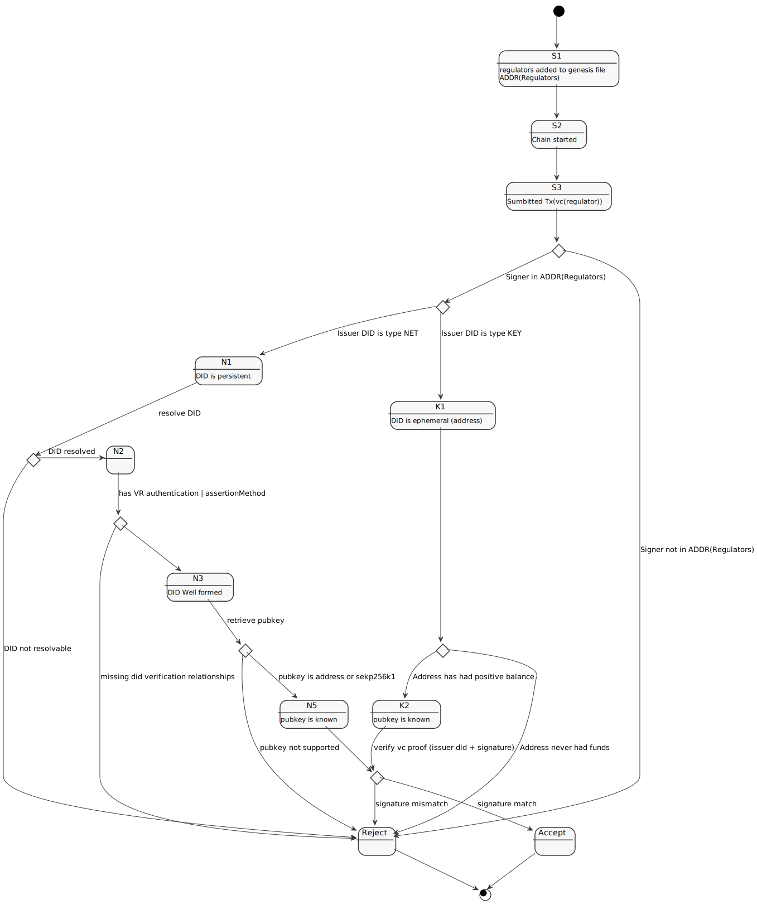

# Regulators

Regulators are the root of trust in the cosmos-cash chain: regulators chain addresses are know before chain launch and their addresses are stored in the genesis file. 

Regulators have the authority to issue registration and license verifiable credentials to E-Money issuers accounts, and through those licenses the issuers can create/mint/burn/redeem tokens on a cosoms-cash powered chain.

## Activation 

A regulator must perform an activation to be able to start issuing verifiable credentials, the activation consists of issuing a **regulator credential** to a DID of its choice. The transaction to issue the regulator credential MUST be signed by an account listed in the regulator addresses in the genesis file. 

In DID indicated as the issuer in the regulator credentials MUST be:

- resolvable: it must be possible to retrieve the DID document that describes the vc issuer DID
- with a verification method listed in the `authentication` or `assertionMethod` relationships
- with the verification method listing a public key or an address with a know public key; in both cases the signature verification scheme used is secp256k1

The following state diagram illustrates the process of activation of a regulator did

<!-- 

@startuml
skinparam monochrome true

state C1 <<choice>>
state C2 <<choice>>
state C3 <<choice>>
state C4 <<choice>>
state C5 <<choice>>
state C6 <<choice>>

state P1 <<choice>>
state "Accept" as OK
state "Reject" as ERR
state END <<end>>

[*] --> S1
S1 : regulators added to genesis file
S1 : ADDR(Regulators)
S2 : Chain started
S3 : Sumbitted Tx(vc(regulator))
K1 : DID is ephemeral (address)
N1 : DID is persistent
S1 --> S2
S2 --> S3
S3 --> C1

C1 --> C2 : Signer in ADDR(Regulators)
C1 --> ERR : Signer not in ADDR(Regulators)

C2 --> K1 : Issuer DID is type KEY
C2 --> N1 : Issuer DID is type NET

K1 --> C3
C3 --> K2 : Address has had positive balance
C3 --> ERR  : Address never had funds

K2 : pubkey is known
K2 --> P1 : verify vc proof (issuer did + signature)

' HERE THE NET METHOD STARTS

N1 --> C4 : resolve DID

C4 -> ERR : DID not resolvable
C4 -> N2 : DID resolved 

N2 --> C5 : has VR authentication | assertionMethod
C5 --> ERR : missing did verification relationships

 
C5 --> N3 
N3 : DID Well formed

N3 --> C6 : retrieve pubkey 

C6 --> ERR : pubkey not supported
C6 --> N5 : pubkey is address or sekp256k1

N5 : pubkey is known
N5 --> P1

P1 --> OK : signature match
P1 --> ERR : signature mismatch

OK --> END
ERR --> END
@enduml

-->

